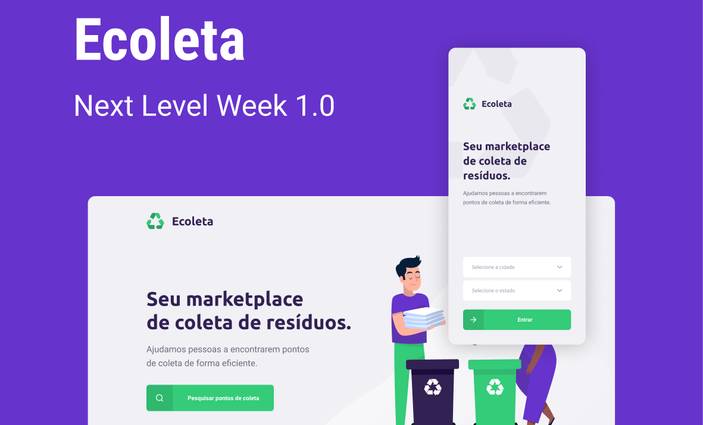

<h1 align="center">
   
</h1>  

  
  
  
  
  
  
  
  
  

<h3 align="center">O Ecoleta é um sistema para contribuir com o meio ambiente</h3>

   Ele visa conectar empresas e organizações que recolhem resíduos,  
   com as pessoas que desejam descartar esses resíduos. 
   Evitando assim o descarte incorreto dos resíduos!  
    
   
   

   

## :sparkles: Tecnologias

Este projeto foi desenvolvido durante [Rocketseat Next Level Week #1](https://rocketseat.com.br) com as seguintes tecnologias:

-  [Node.js](https://nodejs.org/pt-br/)
-  [Express](https://expressjs.com/)
-  [nodemon](https://github.com/remy/nodemon)
-  [SQLite](https://www.sqlite.org/index.html)
-  [Knex.js](http://knexjs.org)
-  [Multer](https://github.com/expressjs/multer)
-  [ReactJS](https://reactjs.org/)
-  [axios](https://github.com/axios/axios)
-  [React Native](http://facebook.github.io/react-native/)
-  [Leaflet](https://leafletjs.com/)
-  [React leaflet](https://react-leaflet.js.org/)
-  [React Icons](https://react-icons.github.io/react-icons/)
-  [Expo](https://expo.io/)
