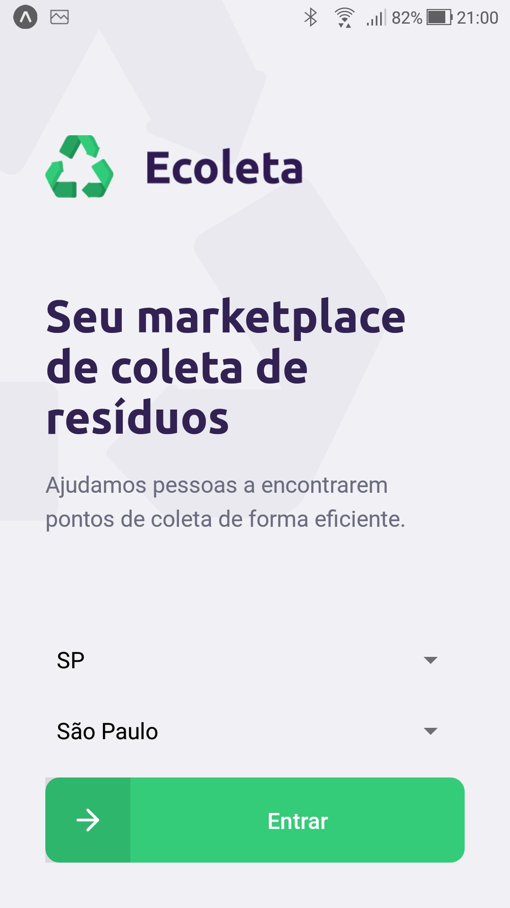
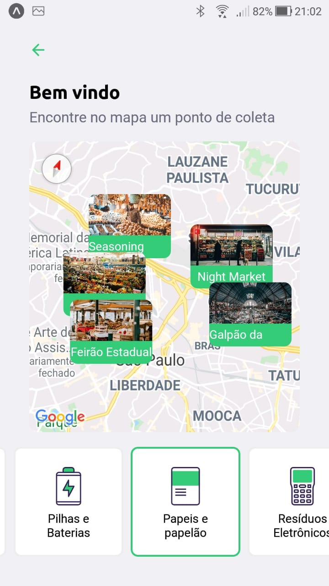
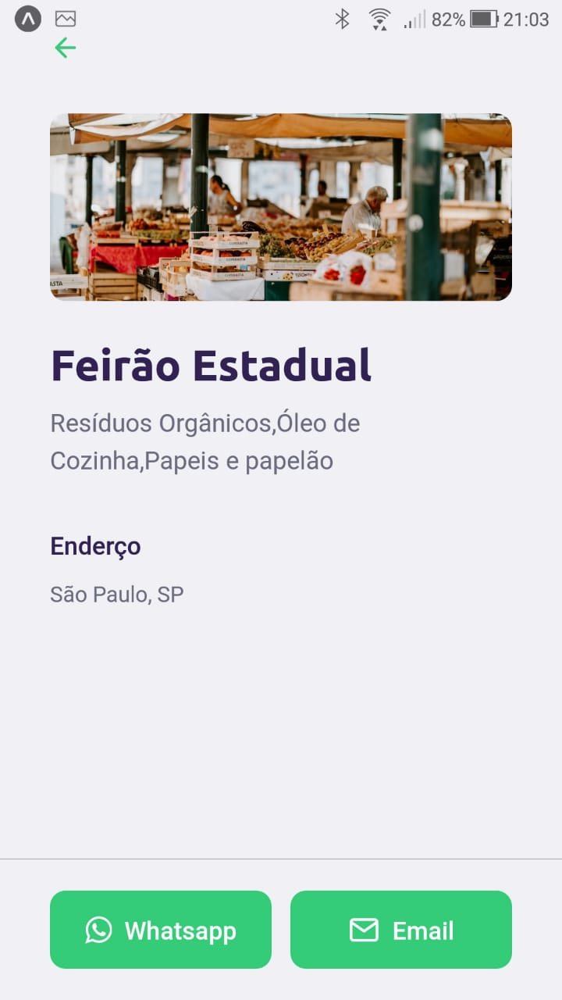

<h1 align="center">App Ecoleta</h1>

  No app Mobile os usuários podem escolher o estado, cidade e os items que deseja descartar, para encontrar o melhor local para levar os resíduos para descarte.

  
  
  

  

  Ele pode ver os pontos de coleta de forma interativa no mapa, clicando em um deles é mostrada uma página contendo os detalhes do local, como todos os items que coleta, localização, email e whatsapp de contato.

  
