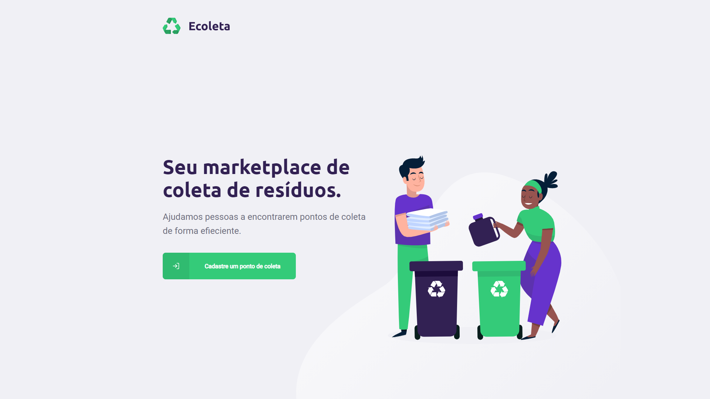
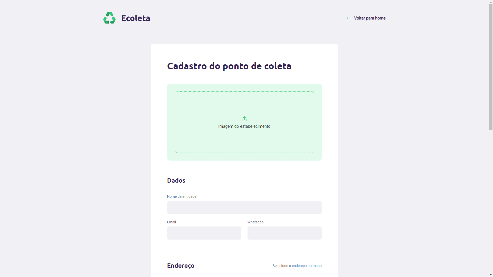
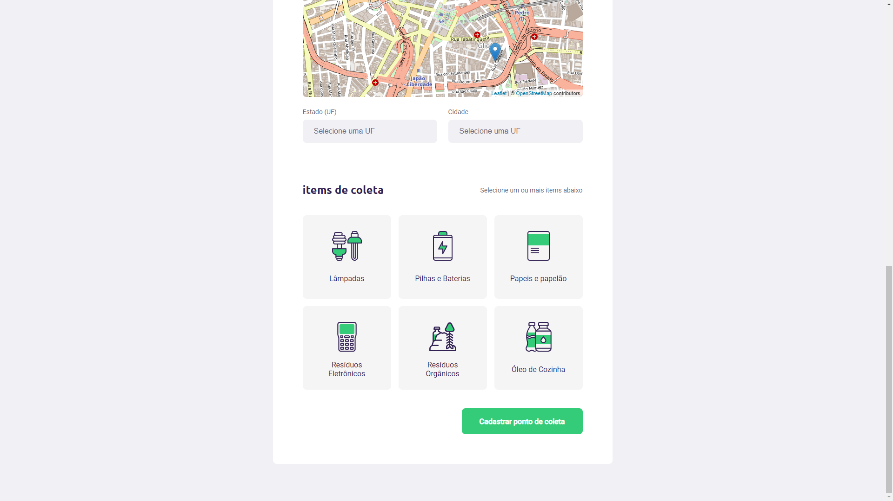

<h1 align="center">Site do Ecoleta</h1>

  No site do Ecoleta empresas e organizações podem adicionar novos pontos de coleta, 
que serão visíveis pelos usários na aplicação mobile.

  

***

<h3>Página principal (Home)</h3>

 
     

  

***

<h3>Página de cadastro de pontos de coleta</h3>

 
    
    
  
  > Aqui os usuários podem cadastrar os pontos de coleta, informando os dados para contato,  localização do ponto de coleta e os items que ele coleta. 

  
